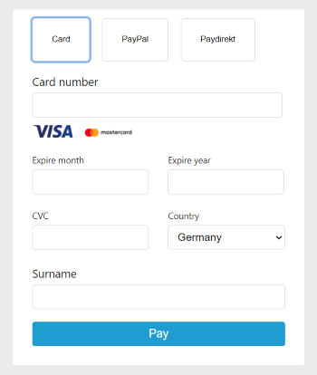
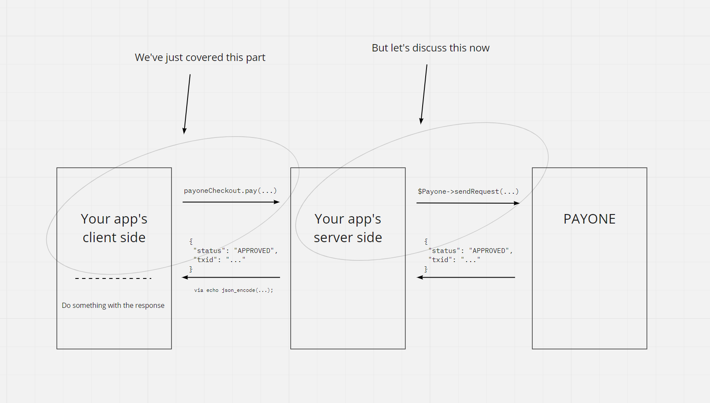
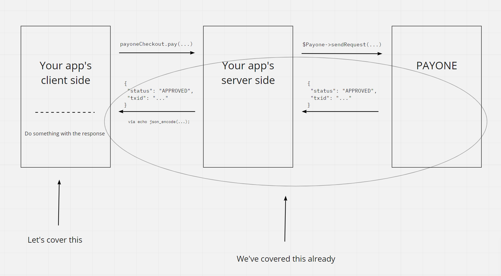

# Overview
This doc page provides a more detailed overview of how the checkout demo app works and
step-by-step instructions on how to implement it by yourself - in ["Let's do it" section](#lets-do-it).

### A bit of theory
The communication between an app and PAYONE comes through simple HTTP messages (requests and responses) in form of key-value pairs.
(read more on that in the [according 'Internals' section](#communication-with-payone)).

These messages contain entries (the key-value pairs; fields) that are always present. For example, you would always see a `status` and `txid` (transaction ID) field in a response sent
by PAYONE, and you would always see an `mid` (merchant ID) or `request` entry in the request that your app would send to PAYONE.

We make use of wrapper classes for PAYONE's Server API (`Payone.php`) and Client API (`PayoneCheckout.js`).
These classes encapsulate some technical details of how PAYONE API works. But we'll cover these technical details in **Internals** section.

_Basically, Server API is used to facilitate communication between a server and PAYONE's system while Client API is used for communication between a browser and PAYONE's system._

# Let's do it!
## Set up client
### Build the form



Of course, to make payments, we would need a form of some sort.
In our current app's implementation, the form is partly built via HTML and partly via JS to facilitate reactive switching of Card/Paypal/Paydirekt payment methods.
We will mount our form input fields onto `#payoneCheckoutFields` section.

```html
// index.php | Lines 40-48

<section id="checkout" class="payone-checkout">
  <form>
    <section class="payone-checkout__fields" id="payoneCheckoutFields"></section>

    <div id="payoneCheckoutLastRow" class="payone-checkout__row">
      <button class="payone-checkout__submit-btn" id="checkoutSubmitButton" type="submit">Pay</button>
    </div>
  </form>
</section>
```

### Insert PAYONE's Client API script and provide your credentials
To be able to receive card data (card number, cvc, etc) and check it for validity, you should use [PAYONE's Client API](https://docs.payone.com/display/public/PLATFORM/Channel+Client+API). It provides iFramed inputs whose work is to process card data, and it also provides ability
to check the card for validity.
So, to use it, we insert the script in the head of our `index.php` file:
```html
// index.php | Line 25

<script src="https://secure.pay1.de/client-api/js/v1/payone_hosted.js" defer></script>
```
_Also, there is a minified version for this script on this URL_ - `https://secure.pay1.de/client-api/js/v1/payone_hosted_min.js`

For being able to use Client API, we need to provide it with our PAYONE credentials. We store our credentials in an `.env` file like this:
```dotenv
// .env

# Your Payone credentials
PAYONE_MERCHANT_ID=12345
PAYONE_PORTAL_ID=7654321
PAYONE_SUBACCOUNT_ID=12345
PAYONE_KEY=superSecretKey123%!

# Payone settings
PAYONE_MODE=test
PAYONE_INTEGRATOR_NAME=PayoneDeveloper
```
_Don't have the credentials yet? Contact [PAYONE](https://www.payone.com/)_

_Also, you will need to configure your [PMI (PAYONE Merchant Interface)](https://docs.payone.com/display/public/PMI/Quick+Start+Guide+-+English) -
the web-platform for managing your interaction with PAYONE_

To use Client API, we need merchant ID, portal ID, sub-account ID and a calculated hash. The hash is generated inside our PHP wrapper class. So, we'll make use of it:
```html
// index.php | Lines 96-103

<script>
  window.payoneApiCredentials = {
    merchantId: '<?php echo $_ENV['PAYONE_MERCHANT_ID'] ?>',
    portalId: '<?php echo $_ENV['PAYONE_PORTAL_ID'] ?>',
    subAccountId: '<?php echo $_ENV['PAYONE_SUBACCOUNT_ID'] ?>',
    hash: '<?php echo $Payone->generateJsHash() ?>'
  }
</script>
```

### Write your logic on handling payments
After we built our checkout, we need to set up a submit event listener for the form.
To do that, we'll make use of our Client API wrapper's `pay` method. The main lines of code are inside the submit
handler - with `const paymentResponse = ...` - this `paymentResponse` variable is what you get after your app
has communicated with PAYONE.

```javascript
// main.js | Lines 1-28

// Grab our settings, put them into our checkout-wrapper class and mount it to the form we've built
const { payoneApiCredentials, payoneApiMode } = window
const payoneCheckout = new PayoneCheckout({apiCredentials: payoneApiCredentials, apiMode: payoneApiMode}).mount('#payoneCheckoutFields')

// Grab the form, and on click...
document.querySelector('form').addEventListener('submit', async (evt) => {
  evt.preventDefault()

  // 2. Get payment response       <--      1. Pay (i.e. send payment data to our app's server endpoint)
  const paymentResponse = await payoneCheckout.pay('/pay.php', {
    items: getCartStorage()
  })

  // Do something with the payment response...
})
```

The image below describes this payment request flow:


So, our [wrapper class's](#what-does-payonecheckoutjs-do) `pay` method internally _communicates with PAYONE_'s Client API to check validity of the card. And then it sends request to our not yet set up server side endpoint. But let's discuss it now in the next section.

_If you want to learn more about `getCartStorage()` function, refer to this ['Internals' section](#why-use-getcartstorage-in-mainjs)_

## Set up server

The whole work for this section will be inside `pay.php` file.

### Make use of PAYONE's wrapper class

```php
// pay.php | Lines 1-12

<?php

require_once 'loadCredentials.php';

$Payone = new \Payone\Payone([
  'mid' => $_ENV['PAYONE_MERCHANT_ID'],
  'portalid' => $_ENV['PAYONE_PORTAL_ID'],
  'aid' => $_ENV['PAYONE_SUBACCOUNT_ID'],
  'key' => $_ENV['PAYONE_KEY'],

  'mode' => $_ENV['PAYONE_MODE'],
  'integrator_name' => $_ENV['PAYONE_INTEGRATOR_NAME']
]);
```

To use our wrapper over PAYONE's Server API, we'll load the credentials and settings (`mode` and `integrator_name`) from our `.env` file and pass them to the constructor.
- `mode` entry can only have values either `test` or `live` - the first serves for playing around with the API, the latter serves for real payment requests.
- `integrator_name` field denotes you as a developer of a PAYONE integration. This entry will be stored in PAYONE's database to further help you if you encounter problems.

### Read POST body

```php
// pay.php | Lines 14-19

$postBody = json_decode(file_get_contents('php://input'), true);

$paymentMethod = $postBody['paymentMethod'];
$surname = $postBody['surname'];
$country = $postBody['country'];
$frontendCartItems = $postBody['items'];
```

Our JS sends the payment data via POST request, so we'll read it and grab the data.
- `$paymentMethod` - it is something that tells us what payment method the user has chosen - card, PayPal or Paydirekt. We will treat each payment method differently, and this variable tells us what payment method we should treat;
- `$surname` - it is a required field for PAYONE's Server API, i.e. all payments must have user's surname included;
- `$country` - the same story as `$surname` - it must be included in all requests, too;
- `$cartItems` - this is data about our cart items, simple.

### Prepare cart items' data

```php
// pay.php | Lines 21-27

$cartItems = [];
foreach ($frontendCartItems as $frontendCartItem) {
  $cartItem = getItemById($frontendCartItem['id']);
  $cartItem['quantity'] = $frontendCartItem['quantity'];

  $cartItems[] = $cartItem;
}
```

Here we are building cart items' data to be passed for our payment request. We are grabbing cart items' data from
our server and passing the quantity from our front-end received cart items.

Note: for more information on why we are getting data about cart items from our server rather than
the front-end, refer to [this 'Internals' section](#why-use-getitembyid-in-payphp)


### Handle different payment methods

```php
// pay.php | Lines 36-63

if ($paymentMethod === 'card') {
  $pseudoCardPAN = $postBody['pseudoCardPan'];

  $payoneResponse = $Payone->sendRequest([
    // Payment data
    'request' => 'preauthorization',
    'clearingtype' => 'cc',
    'reference' => uniqid(),
    'amount' => getTotalPriceForItems42And43(),
    'currency' => 'EUR',

    // Customer data
    'lastname' => $surname,
    'country' => $country,

    // Cart items
    'items' => $cartItems,

    // Redirect URLs
    'successurl' => "http://{$_SERVER['HTTP_HOST']}?paymentStatus=success",
    'errorurl' => "http://{$_SERVER['HTTP_HOST']}?paymentStatus=error",
    'backurl' => "http://{$_SERVER['HTTP_HOST']}?paymentStatus=back",

    // Payment data specific to 'clearingtype'
    'pseudocardpan' => $pseudoCardPAN
  ]);
}
```

So, what do we do here? Right now, we actually do a real payment request to the PAYONE system.
The payment request is done via a simple HTTP POST request with our data that comes in form of an array. All this work is done via our wrapper class's `sendRequest` method.
But to make the request, we need to specify entries for the array. Let's go over these entries:

- `request` - shows what financial operation you want to perform. `preauthorization` means booking the amount of money on the customer's card and then in future we would get the money by performing a
  `capture` request. There is also `authorization` request that does these two things together at once. For more on the types of requests, follow [this page](https://docs.payone.com/display/public/PLATFORM/SA+-+Payment-Requests);
- `clearingtype` - shows *means by which we get money* from the customer. `cc` means that we get the money via the customer's card
- `reference` - your app's unique identifier of a transaction. Most probably you'll want it stored in your database for future use;
- `amount` - amount of money of a specified currency in the smallest units, e.g. cents;
- `currency` - a currency, simple;
- `lastname` - a required field for PAYONE's system;
- `country` - a required field as well. Just what we've been talking about in ['Read POST body' section](#read-post-body);
- `items` - data about our cart items;
- `Redirect URLs` section - quite often payment method providers (PayPal, Paydirekt, etc.) redirect the customer from a third party app (our app, for example) onto their own services. In the web world,
  it means that after the customer hits the button "Pay", they get redirected to e.g. PayPal's website to complete the payment. And then PayPal redirects the customer back to the website (i.e. our app) in which they had initially hit the
  "Pay" button. In our app, you'll be able to see it in action in use case ['Pay via Paydirekt'](../README.md#pay-via-paydirekt)
- `Payment data specific to 'clearingtype'` section - different payment methods require different data. For example, to make a card payment, we of course need to know the card number (more specifically,
  its pseudo card number, which is called `pseudocardpan` in PAYONE's system). But as for Paydirekt, it requires shipping address data, like zip, city, etc.

For more information about the fields, check [this PAYONE's docs page](https://docs.payone.com/pages/releaseview.action?pageId=1213939)

### What will PAYONE send you?

PAYONE will send you a successful/erroneous response regarding your transaction. A typical response would look like this:

- A successful response (it is sent if paying via a card without 3DSecure step - ['Pay via a card without 3DSecure'](../README.md#pay-via-a-card-without-3dsecure)

```json
{
  "status": "APPROVED",
  "txid": "606946635",
  "userid": "363442903"
}
```

- A redirect response (this one is sent if paying via a card that comes with a 3DSecure step - ['Pay via a card with 3DSecure'](../README.md#pay-via-a-card-with-3dsecure)

```json
{
  "status": "REDIRECT",
  "redirecturl": "https://threedssvc.pay1.de:443/3ds/3ds1/challenge/redirect/62b0f6cb-5e6f-4b04-b405-b13c91da3657",
  "txid": "606940397",
  "userid": "363438780"
}
```

- An erroneous response (this one is sent if paying with card with an invalid expire month like '13' - which doesn't exist)

```json
{
  "status": "ERROR",
  "pseudocardpan": "null",
  "truncatedcardpan": "null",
  "cardtype": "null",
  "cardexpiredate": "null",
  "errorcode": "1077",
  "errormessage": "Expiry date invalid. Please verify your card data."
}
```

Ok, we got the response. What's next?
Well, we should show the customer that something happened, i.e. notify them - either everything is fine and the payment succeeded or something went wrong. How can we do that?

### Output the response

```php
// pay.php | Line 122

echo json_encode($payoneResponse);
```

On our server side endpoint, we will simply output the PAYONE response to further read it in our client side.

### Do something with the response from our server side endpoint

Ok, here's what we've covered from our payment request flow diagram:


As for "Do something with the response", `paymentResponse` variable in our JS file is actually the thing we want to do something with.

```javascript
// main.js | Lines 9-11

const paymentResponse = await payoneCheckout.pay('/pay.php', {
  items: getCartStorage()
})
```

Essentially, we get the JSON response we got on our server side endpoint like:
```json
{
  "status": "APPROVED",
  "txid": "606946635",
  "userid": "363442903"
}
```

But in the app, our PAYONE Client API wrapper class `PayoneCheckout` puts some fields on top of this response, and we get a JS object like this:

```json
{
  "status": "success",
  "type": "payment_success",
  "message": "Payment succeeded ✓",
  "txid": "606951225",
  "_payone_response": {
    "status": "APPROVED",
    "txid": "606946635",
    "userid": "363442903"
  }
}
```

In the case of our app, we simply log the response (i.e. this JS object) and do some further logic to notify the user of the status of the payment:
```javascript
// main.js | Lines 12-15

console.log('%c The payment response:', 'color: #ca880f') // orange-ish color
console.log(paymentResponse)

showMessageInCheckout(paymentResponse)
// ...
```

### That's it! But we also need to verify the transaction

Alright, we are pretty much finished with the payment request flow. But also, PAYONE will send a notification to your app that tells the data about a transaction - its status and other related data.
In our demo app, we receive it straightly after a redirect payment method - ['Pay via Paydirekt'](../README.md#pay-via-paydirekt).

This important step verifies the status of the transaction - when PAYONE sends such a notification to your app,
**it means that the transaction really went fine/with problems**, and you should update the order status
in your database accordingly.

To listen for the notification, you could set up another endpoint, e.g. `payone-notifications-listener.php` that
would listen for the POST requests from PAYONE. You can read more on that
in [this section of Payone's docs](https://docs.payone.com/display/public/PLATFORM/Getting+Started+with+TransactionStatus+Notifications).
The message you'll get will look something like this:

```json5
{
  "key": "17031f73e2c6f9755788bddfff041jko",
  "txaction": "appointed",
  "clearingtype": "cc",
  "txtime": "1638191380",
  "currency": "EUR",
  // ...
}
```

# Internals
This section describes some internals of how the app works and some more detailed
explanations on the PAYONE API.

## Communication with PAYONE
Bare communication with PAYONE comes through HTTP POST request with `key=value` pairs inside
the body.
`Payone.php`'s job is to provide more handy way to communicate with PAYONE - `Payone` class
enables us to use simple PHP arrays rather than meddling with raw HTTP requests.

## What does `PayoneCheckout.js` do?
PAYONE uses [Client API](https://docs.payone.com/display/public/PLATFORM/Channel+Client+API) to be compliant with
[PCI Security Standards](https://www.pcisecuritystandards.org/) regarding usage of online card payments.

This wrapper class encapsulates
- building the form with iFrames hosted inputs (Client API's stuff) that process card data (to be compliant) - inside method `mount`
- event for valid/invalid card check - inside method `pay`
- logic for communicating with our server side endpoint - inside method `pay`

So, the algorithm of the work of this class is:
```
1. Mount to an element
2. When form submitted, ask PAYONE's Client API if the card number, cvc, expiry date are valid
  |
  ◇ It's valid? 
  |
  -> No -> Get error response from Client API. Start over from step 2.
  |
  Yes
  |
3. Send payment data to our server side endpoint  
4. When got response from our server side endpoint (that, in turn, got response from PAYONE), do something with the response      
```

## Why use `getCartStorage()` in `main.js`?
This function only serves one purpose - get cart items' data from somewhere. Here, we simply use stub
data. But this data could come from PHP's `$_SESSION`, a cookie, JS's `localStorage`, etc.

You need to know one thing - you have to implement a way how you would take your cart items' data
and put it into the payment request.

## What does `Payone.php` do?
As stated previously in ['Communication with PAYONE'](#communication-with-payone) section, instead of meddling with raw HTTP requests, we
use `Payone` class that encapsulates this raw HTTP messaging and uses PHP simple arrays.

It uses PHP's cURL extension for sending HTTP requests - you can see it inside `sendRequest` method.

Also, it provides a more convenient way to include cart items' data into your payment request.
With this wrapper class, you can write `'items' => $cartItems` in your request array, just like
we did in our app; Bare PAYONE represents cart items' data via `id[n], pr[n], ...` fields, where
`id` is cart item's SKU and `pr` is cart item's price, and `n` means number of the cart item
in a list. You can check more information on that, for example, [here](https://docs.payone.com/display/public/PLATFORM/it%5Bn%5D+-+definition).

## Why use `getItemById()` in `pay.php`?
We grab data within our server rather than the front-end to mitigate the **vulnerability of being
able to change data** about cart items' data in the front-end.

We also have function `getTotalPriceForItems42And43()` inside `pay.php` - it serves the same purpose; we should always
calculate prices within our server to prevent hackers from changing data in the front-end.

# A note on security
Currently, as the main [Readme](/README.md) suggests, we use `php -S localhost:3000` to spin up the local server.
But the problem here is that we are able to access _all_ the files inside our project, even `.env`!
In real world, you have to make sure that end users are **not** able to access such files. To do that, you have to
tweak settings of your webserver (Apache/Nginx/etc.).

As a side note, actually you can implement a router script for PHP's built-in webserver. Check [its official](https://www.php.net/manual/en/features.commandline.webserver.php)
page under section 'Example #3 Using a Router script'.

# Use cases' test data
To test the checkout, you will need some test data.

Test card numbers:
- Card number without 3DSecure - `4111111111111111`
- Card number with 3DSecure - `4012001037141112`
- 3DSecure password on 3DSecure page - `12345`

Test input data:
- Expire month - any valid month number, i.e. `from 1 to 12`
- Expire year - any year in future, i.e. assuming today is 2021: `2022`, `2023`, ...
- CVC - any combination of numbers: `123`, `555`, ...
- Surname - any string with more than one characters

More on the test data you can find on [this page](https://docs.payone.com/display/public/PLATFORM/Testdata).
